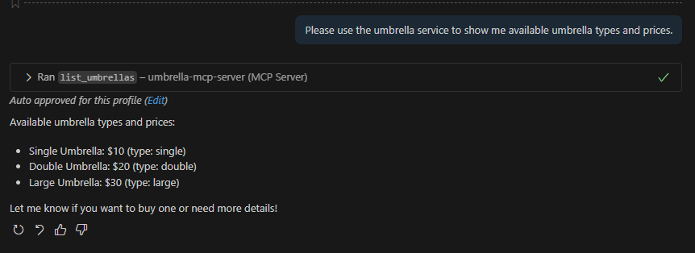

### Description
It's a http mcp server instance.   
It's actually a http service with serveral mandatory end points which MCP requries 

#### Test end point
        curl -X POST http://localhost:3000/mcp \
        -H "Content-Type: application/json" \
        -d '{"jsonrpc":"2.0","id":3,"method":"tools/call","params":{"name":"buy_umbrella","arguments":{"type":"double","quantity":2}}}'

### Setup http MCP Server
#### mcp.json
        {
            "servers": {
                "weather-mcp-server": {
                    "type": "stdio",
                    "command": "node",
                    "args": [
                        "D:/git/AI/mcp/weather-mcp/server-minimal.js"
                    ]
                },
                "umbrella-mcp-server": {
                    "url": "http://localhost:3000/mcp",
                    "type": "http"
                }
            },
            "inputs": []
        }

### Test
Please use the umbrella service to show me available umbrella types and prices.

### Question 
#### Question1
http://localhost:3000/mcp 看上去就像是一个普通的end point, 它遵守了什么MCP协议吗？
#### Answer 
你的MCP服务器在 http://localhost:3000/mcp 这个端点上，主要处理来自客户端的JSON-RPC请求，整个过程遵循MCP协议规范 。基本的交互流程如下：

初始化：MCP客户端（如Claude Desktop）会向 /mcp 端点发送一个 initialize 请求，与服务器建立连接并交换能力信息 。

列出工具：客户端发送 tools/list 请求，你的服务器会返回可用的工具列表，例如雨伞购买服务中的 list_umbrellas 和 buy_umbrella 。

调用工具：当用户在对话中要求查询雨伞或购买时，客户端会向 /mcp 端点发送 tools/call 请求，服务器执行相应的工具逻辑后返回结果。

