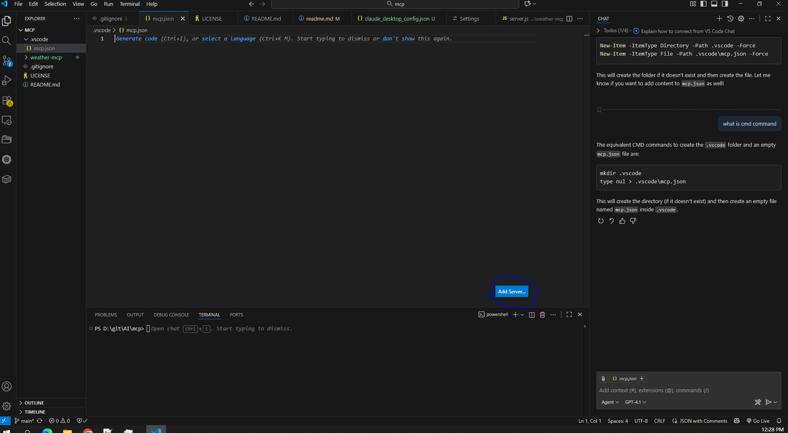
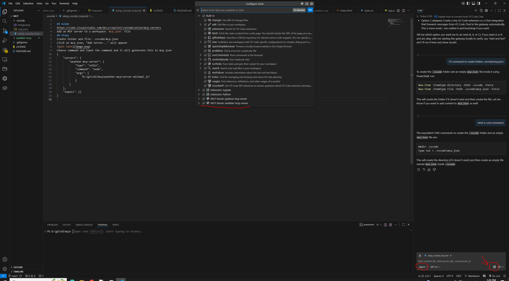
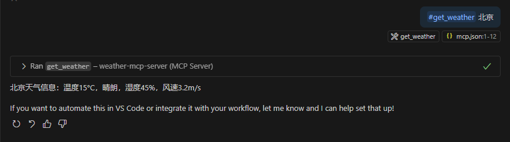
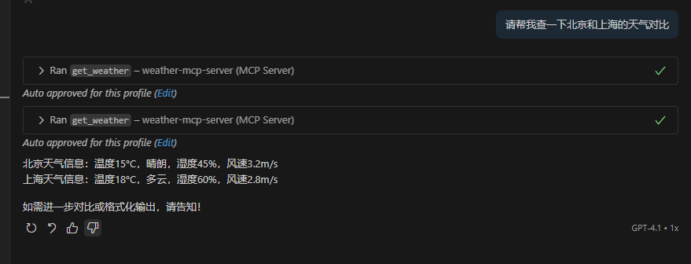

## Guide 
https://code.visualstudio.com/docs/copilot/customization/mcp-servers
Add an MCP server to a workspace `mcp.json` file
## Steps
Create folder and file: .vscode/mcp.json   
Click on mcp.json, "Add Server..." will appear    

Choose command and input the command and it will gennerate this in mcp.json
{
	"servers": {
		"weather-mcp-server": {
			"type": "stdio",
			"command": "node",
			"args": [
				"D:/git/AI/mcp/weather-mcp/server-minimal.js"
			]
		}
	},
	"inputs": []
}
Choose our mcp server as tools 

### Try
#get_weather 北京

请帮我查一下北京和上海的天气对比
