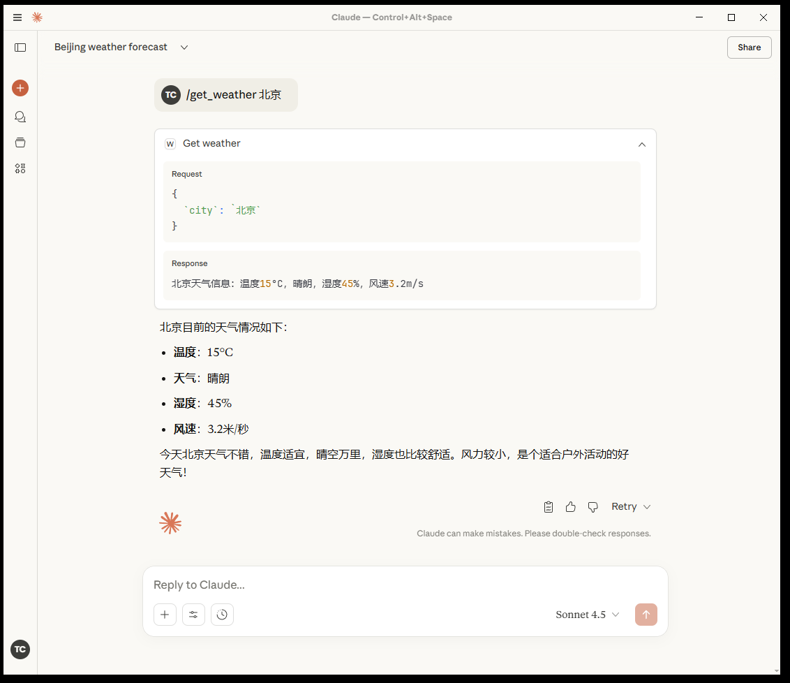
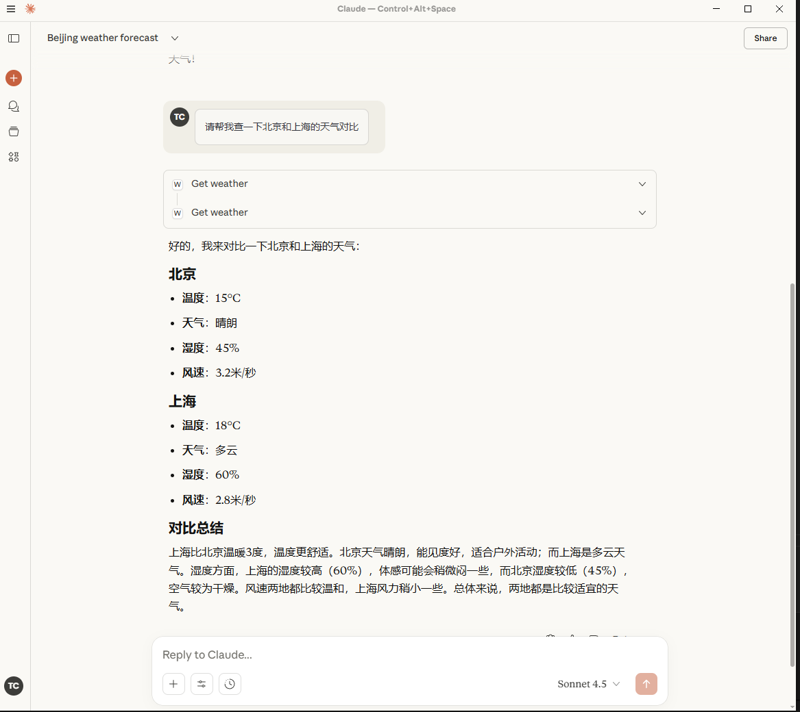

## Descirption
server.js is the MCP Server, it provoide one fuction: get weather by city
mcp-gateway.js is the api which connect to the MCP server 
server-minimal.js is the MCP Server which used in Claude Desktop, it removed all debug information from server.js
## Start MCP Server Gateway
node .\mcp-gateway.js
### How will the gateway connect to the MCP Server?
    mcpServer = spawn('node', ['server.js'], {
      stdio: ['pipe', 'pipe', 'pipe']
    });

    const request = {
        jsonrpc: "2.0",
        id: requestId,
        method: "tools/call",
        params: {
        name: toolName,
        arguments: params
        }
    };

    mcpServer.stdin.write(JSON.stringify(request) + '\n');

## Test
#### Use request.json to avoid enconding problem
echo '{"city":"北京"}' > request.json
curl -X POST http://localhost:3001/api/tools/get_weather \
  -H "Content-Type: application/json; charset=utf-8" \
  -d @request.json
#### expect result 
📥 MCP 原始输出: {"result":{"content":[{"type":"text","text":"🌤️ 北京 实时天气信息：\n📍 城市：北京\n🌡️ 温度：15°C\n☁️   天气状况：晴朗\n💧 湿度：45%\n💨 风速：3.2m/s\n🕐 更新时间：2025/10/12 09:48:04"}]},"jsonrpc":"2.0","id":1760233684444}  

## Question 
### Question1
如果是为了获取天气，那直接开发一个获取天气的api就行了，搞个MCP server 好像是多此一举，MCP server到底有什么使用场景？
### Anaswer
适合 MCP 的场景：
✅ 需要AI助手参与的工作流
✅ 非技术人员需要操作复杂系统
✅ 需要动态组合多个工具
✅ 自然语言交互更友好的场景
#### For Example
你：请帮我查一下北京和上海的天气对比
Claude：[调用 get_weather 工具查询北京]
        [调用 get_weather 工具查询上海]
        [分析对比结果]

Claude：根据查询结果：
• 北京：15°C，晴朗，适合户外活动
• 上海：18°C，多云，建议带伞
北京天气更好，但温差较大...

## Claude Desktop
### Create the configuration file 
C:\Users\lenovo\AppData\Roaming\Claude\claude_desktop_config.json
{
  "mcpServers": {
    "weather": {
      "type": "stdio",
      "command": "node",
      "args": ["D:/git/AI/mcp/mcp-web-client/weather-mcp/server-minimal.js"]
    }
  }
}
### Test
#### Input
/get_weather 北京
#### Result 

#### Input
请帮我查一下北京和上海的天气对比
#### Result

### Log 
C:\Users\lenovo\AppData\Roaming\Claude\logs\mcp.log  
C:\Users\lenovo\AppData\Roaming\Claude\logs\mcp-server-weather.log

